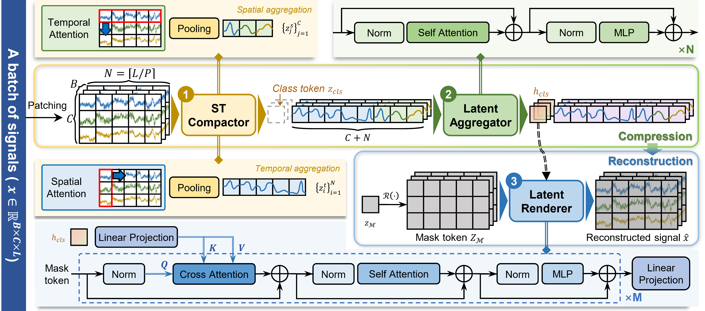

# SPOTR: Spatio-temporal Pooling One-Token Reconstruction for Universal Physiological Signal Self-supervised Learning

## Overview

Physiological signals such as **EEG**, **iEEG**, **ECG**, and **PPG** are widely used in clinical monitoring and health assessment. However, existing self-supervised learning methods for physiological signals often suffer from three practical limitations:

1. **Limited cross-dataset generalization** under heterogeneous acquisition settings.
2. **Shortcut learning** caused by temporal continuity and cross-channel redundancy in masked reconstruction.
3. **High computational cost** when Transformer models flatten spatiotemporal tokens into long sequences.

We propose **SPOTR** (**S**patio-temporal **P**ooling **O**ne-**T**oken **R**econstruction), a universal self-supervised learning framework for physiological signals. SPOTR compresses each input waveform into a **single global token** and reconstructs the signal only from this bottleneck, encouraging compact, global, and transferable representations.


## Method

<p align="center">
  
</p>

SPOTR contains three main components:

1. **ST Compactor**
   Compresses the input waveform into compact temporal tokens and spatial tokens through attention-based spatiotemporal pooling.
2. **Latent Aggregator**
   Aggregates the compact spatiotemporal tokens into a single global class token.
3. **Latent Renderer**
   Reconstructs the original physiological signal from mask tokens conditioned only on the single global token.

This design forces reconstruction to rely on globally organized information instead of local visible context, reducing shortcut learning and improving representation transfer.


## How to Use

### 1. Install the dependencies

SPOTR requires Python 3.9 or later and a PyTorch build that provides
`torch.nn.functional.scaled_dot_product_attention` (PyTorch 2.0 or later).

```bash
python -m venv .venv
source .venv/bin/activate
pip install "torch>=2.0" einops tqdm
```

For GPU training, install the PyTorch build that matches your CUDA version.

### 2. Run the pre-training demo

`pretrain_demo.py` trains the encoder and decoder on a synthetic 12-channel
physiological-signal-like dataset. It automatically falls back to CPU when CUDA
is unavailable.

```bash
python pretrain_demo.py \
  --device cuda \
  --epochs 5 \
  --batch_size 64 \
  --channels 12 \
  --output_dir checkpoints
```

The script saves the final weights as:

```text
checkpoints/spotr_encoder_last.pt
checkpoints/spotr_decoder_last.pt
```

The paper uses AdamW with a peak learning rate of `2e-4`, weight decay `0.1`,
3 pre-training epochs, a 10% warm-up, and bfloat16 precision. The demo keeps the
training loop intentionally minimal and exposes the main model and optimizer
settings as command-line arguments.

### 3. Train on your own signals

Replace `DemoSignalDataset` with a dataset whose `__getitem__` method returns a
floating-point tensor with shape `[C, T]`, where `C` is the number of channels
and `T` is the number of time samples. The data loader will produce batches with
shape `[B, C, T]`. The encoder applies channel-wise Z-score normalization.

```python
class MySignalDataset(torch.utils.data.Dataset):
    def __getitem__(self, index):
        signal = load_signal(index)  # NumPy array or tensor with shape [C, T]
        return torch.as_tensor(signal, dtype=torch.float32)
```

The experiments in the paper resample downstream signals to 200 Hz and apply a
50 or 60 Hz notch filter according to the acquisition region. Apply equivalent
dataset-specific preprocessing before returning each tensor when reproducing
the reported setup.

### 4. Extract representations

Use the first output token as the global representation for linear probing or
other downstream tasks:

```python
import torch
from SPOTR import SPOTREncoder

device = "cuda" if torch.cuda.is_available() else "cpu"
encoder = SPOTREncoder(
    encoder_dim=512,
    patch_size=100,
    num_heads=8,
    n_layers=12,
).to(device)

state_dict = torch.load(
    "checkpoints/spotr_encoder_last.pt",
    map_location=device,
)
encoder.load_state_dict(state_dict)
encoder.eval()

x = torch.randn(8, 12, 2000, device=device)  # [B, C, T]
with torch.no_grad():
    tokens = encoder(x)                       # [B, 1 + C + N, D]
    representation = tokens[:, 0]             # [B, D]
```

For classification, `SPOTRClassifier` adds a linear head to this first token:

```python
from SPOTR import SPOTRClassifier

model = SPOTRClassifier(
    encoder_dim=512,
    patch_size=100,
    num_heads=8,
    n_layers=12,
    num_classes=5,
).to(device)
model.encoder.load_state_dict(state_dict)
model.eval()
logits = model(x)  # [B, num_classes]
```

### Shape and configuration notes

- `encoder_dim` must be divisible by both 8 and `num_heads`; `decoder_dim` must
  be divisible by `num_heads`.
- The current learnable 2D positional embeddings support at most 128 channels
  and 128 temporal patches.
- With the default `patch_size=100`, keep the input length at or below 12,800
  samples. Inputs are padded internally to a multiple of 200 samples.
- When loading a checkpoint, use the same encoder architecture that was used to
  create it.


## Citation

If you find this project useful, please consider citing our paper:
